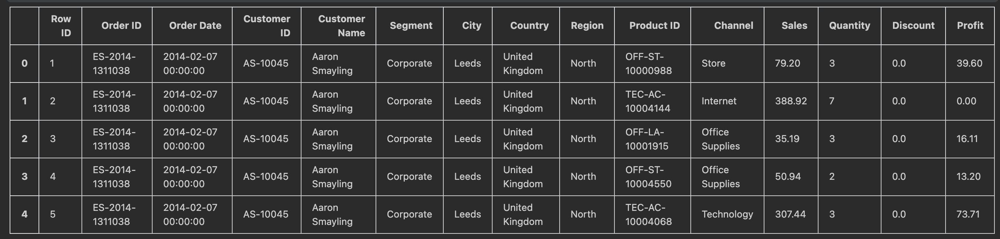

# Product Sale - Dataset Analysis

Project developed to analyse a data cotaining office product sales.

### Basic requirements:
1) Generate simple descriptive statistics on the following columns in the file

a. Order date
b. City
c. ProductId
d. Sales
e. Quantitiy

By descriptive statistics we mean:
• Number of records and number of distinct records
• Frequency table and histogram
• Mean, Median, Min, Max, Sum for Sales and Quantity

2) Develop the distribution and visualize it using the Box and Whisker plot for the combination of the
   columns sales, city
3) Find any outliers and missing data for the columns in point 1.
4) Bind the data for column Quantity into 5 parts and present in a histogram.

### Prerequisites:
* Python 3.8
* Jupyter Notebook

### Used libs:
* numpy
* pandas
* seaborn

### Dataset Head

